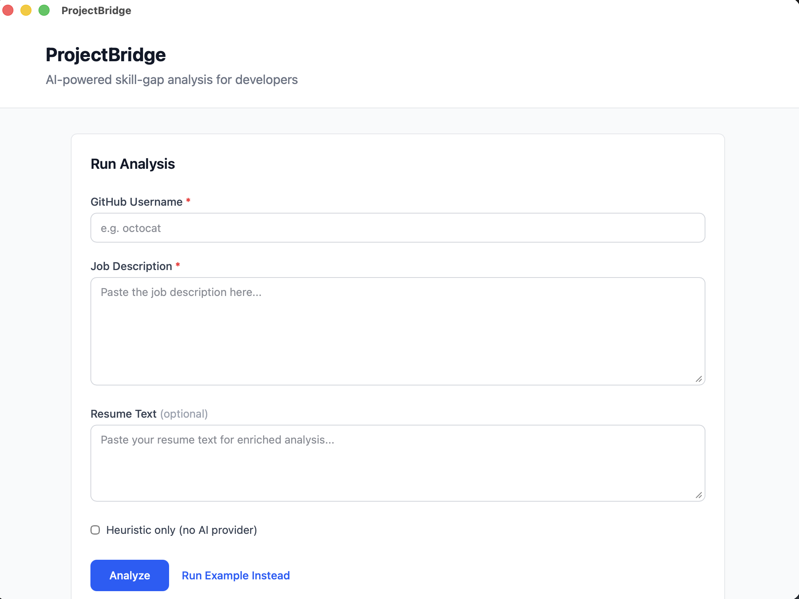

# ProjectBridge

[](https://github.com/akuligowski9/project-bridge/actions/workflows/test.yml)
[](https://www.python.org/downloads/)
[](LICENSE)

**Analyze your GitHub repos against job descriptions and get concrete project ideas to close skill gaps.**

> *What should I build next to move toward the role I want?*

Runs entirely on your machine. No accounts. No uploads.



---

## Quickstart

```bash
pip install projectbridge
```

Try the built-in example (no GitHub token or AI provider required):

```bash
projectbridge analyze --example
```

<details>
<summary>Sample output (trimmed)</summary>

```json
{
  "schema_version": "1.2",
  "experience_level": "mid",
  "strengths": [
    { "name": "Python", "category": "language" },
    { "name": "React", "category": "framework" },
    { "name": "Docker", "category": "infrastructure" }
  ],
  "gaps": [
    { "name": "TypeScript", "category": "language" },
    { "name": "Kubernetes", "category": "infrastructure" },
    { "name": "PostgreSQL", "category": "tool" }
  ],
  "recommendations": [
    {
      "title": "Build a REST API with Django",
      "description": "Create a RESTful API using Django REST Framework...",
      "skills_addressed": ["Django", "REST API"],
      "estimated_scope": "medium",
      "skill_context": "Django powers production web apps from startups to enterprises..."
    }
  ],
  "portfolio_insights": [
    {
      "category": "infrastructure",
      "message": "Your portfolio doesn't demonstrate deployment or infrastructure skills..."
    }
  ],
  "interview_topics": [
    {
      "skill": "Kubernetes",
      "topics": ["Pod lifecycle and deployment strategies", "Services, ingress, and networking"]
    }
  ]
}
```

</details>

Run with your own data:

```bash
projectbridge analyze --job job.txt --github-user your-username
```

Export as Markdown:

```bash
projectbridge export --job job.txt --github-user your-username
```

### Install from source

```bash
git clone https://github.com/akuligowski9/project-bridge
cd project-bridge
pip install -e ./engine
```

---

## What It Does

ProjectBridge reads a job description, scans your GitHub profile, and produces a structured analysis with:

- **Strengths** — skills you already demonstrate
- **Gaps** — skills the job requires that your repos don't show
- **Recommendations** — concrete project ideas to close those gaps

Key capabilities:

- **4 AI providers** — OpenAI, Anthropic, Ollama, or no-AI heuristic fallback
- **97+ framework/tool detections** — from React to Terraform
- **31 curated project templates** — scoped as small, medium, or large
- **Experience calibration** — infers junior/mid/senior level, adjusts recommendation difficulty
- **Portfolio insights** — surfaces underrepresented areas (missing infra, domain gaps, imbalance)
- **Interview prep** — maps 40 gap skills to common interview topics
- **Personalized recommendations** — references your existing skills as a foundation
- **Non-technical JD rejection** — catches non-tech job descriptions early with a clear error
- **Desktop app** — Tauri + Svelte 5 UI for visual exploration
- **Structured JSON output** — schema v1.2, ready for CI/CD or downstream tools
- **File-based caching** — skip redundant GitHub API calls
- **Privacy-first** — tokens stay local, no telemetry, no uploads

---

## Architecture

```
Tauri Desktop App (Svelte 5 + TypeScript)
        ↓
  Python Engine (pip install projectbridge)
        ↓
  Analysis Pipeline
    ├── GitHub repo scanner
    ├── Job description parser
    ├── Skill matcher
    └── Recommendation engine
        ↓
  AI Provider Interface (pluggable)
    ├── OpenAI  ├── Anthropic  ├── Ollama  ├── None (heuristic)
        ↓
  Structured JSON Output (schema v1.2)
```

---

## AI Setup

AI is optional — ProjectBridge works great without it. To enable AI-enhanced recommendations for free, use **Ollama** (local, no API key, no cost):

```bash
# Install Ollama (macOS)
brew install ollama

# Start the server and pull a model
ollama serve
ollama pull llama3.2
```

Then create `projectbridge.config.yaml`:

```yaml
ai:
  provider: ollama
```

That's it. See the full **[AI Setup Guide](docs/AI_SETUP.md)** for other providers (OpenAI, Anthropic) and troubleshooting.

Prompts are transparent and editable — see `engine/projectbridge/ai/prompts/`.

---

## Desktop App

The Tauri desktop app provides a visual interface for running analyses and exploring results.

```bash
cd app
npm install
npm run dev
```

Requires the Python engine to be installed (`pip install -e ./engine`).

---

## Privacy

ProjectBridge is intentionally not SaaS.

- GitHub tokens never leave your machine
- Private repositories remain private
- No telemetry or analytics
- All outputs stored locally

---

## Contributing

ProjectBridge is designed to be forked and extended. Common areas:

- AI provider integrations
- Language/framework detection
- Recommendation improvements
- Export formats
- UI improvements

See [CONTRIBUTING.md](docs/CONTRIBUTING.md).

---

## License

MIT License — see [LICENSE](LICENSE).
